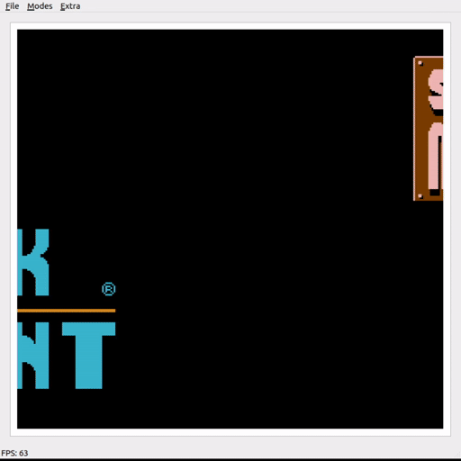

# NES emulator

Little pet project to try and code a NES emulator. The end goal is to make it available via C++ and also Python, to link it with a ML setup.

This project is cross-platform and should work on Windows and Linux.

Based on the wonderful tutorial from OneLoneCoder: https://github.com/OneLoneCoder/olcNES

**-- DISCLAMER --**

There is no rom included in this project. You need to dump your original games to use them with this emulator.

## Dependencies
- qt
- googletest
- sfml

## Implemented features
- Full support for offical opcodes for the 6502 CPU
- Keyboard support
- NTSC roms only (no PAL yet)
- Some mappers (list bellow)
- Basic debugging with "gotos" and disassembly
- Can play from start to finish some games.

## TODO
- Sound
- More mappers
- Rom loading in UI (only cmd line for now)
- ...

## Full interface


## Supported mappers
| Mappers  | Game Example       | Video    |
| ----------------| ------------------- | -------- |
| 0               | Super Mario Bros.   |  |
| 1               | The Legend of Zelda |   |
| 2               | Duck Tails          |   |
| 3               | DonkeyKong Classics |   |
| 4               | Super Mario Bros. 3 |   |
| 40              | SMB: The Lost Levels|   |
| 66              | Duck Hunt + SMB     |   |

## Compiling on Ubuntu
```
git clone --recursive https://github.com/Amathlog/nes-emulator.git
apt-get install qt5-default cmake build-essentials clang
cd nes-emulator
mkdir build
cd build
cmake ..
make
```

## Running the program
```
./NesEmulator <path_to_your_rom>
```

Controls:
| Keyboard | NES Controller |
| -------- | -------------- |
| Arrows   | D-Pad          |
| Z        | A              |
| X        | B              |
| A        | Select         |
| B        | Start          |
